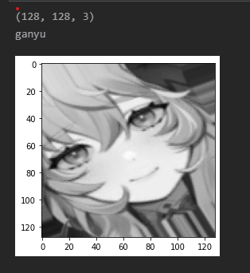
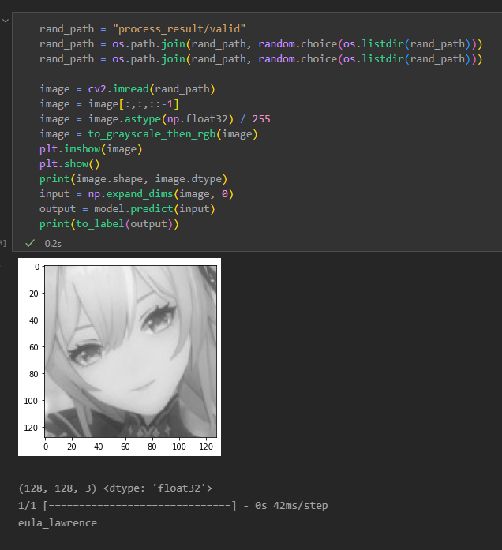
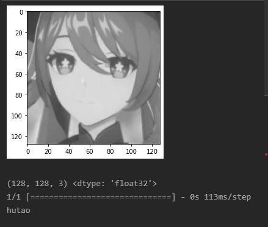
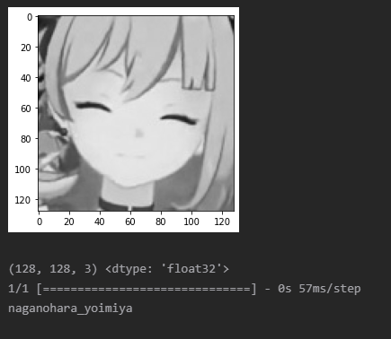

# genshin-illustrations

## Genshin Illustrations Classification
A deep learning based image classification example to determine genshin impact charactor from a grayscale image.

## Dataset

Over 300 genshin solo chatracter illustrations are collected and categorized with the character's birthplace and their name.

File Structure:
> `nation-name` / `character-name` / `character-image.jpg`

## Preprocessing
`datagen` is anime face detector to extract the face images from the dataset. `process.py` generates face images into `process_result` folder and stores them by name.

## Training
You can train and test the model in `train.ipynb`.

## Results

### Datagen (image augmentation) result:  
  

### Prediction results from validation set:  
  
  
  
